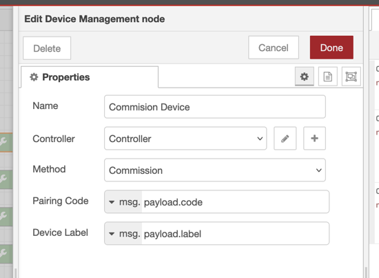
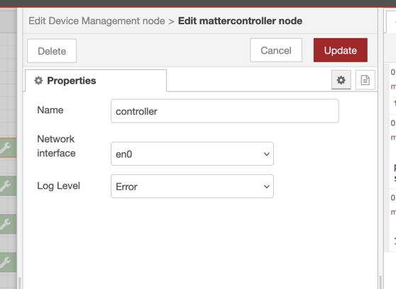
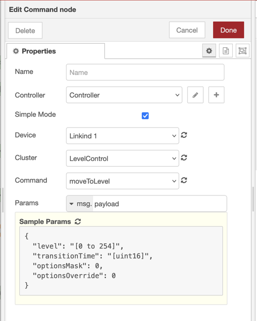
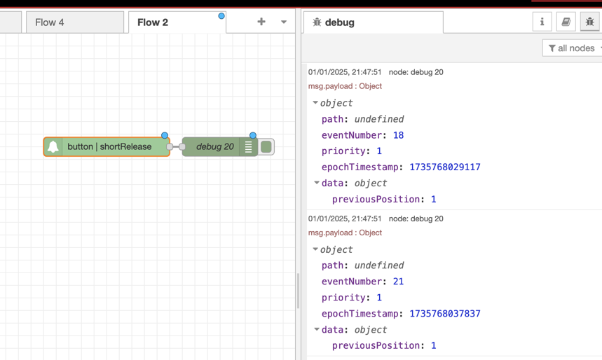

# Node-RED Matter Controller

This package is designed to allow users to control Matter devices from Node RED

## Limitations IMPORTANT!
Currently this controller does not support commisioning via Bluetooth, this means that the Matter device must already be connected to the same network as the controller before it can be commisioned. Usually this will require you to connect the device firstly to another Matter controller such as Apple Home, Google Home or Alexa etc.
You can then add this controller as a 2nd ecosystem, known as Multi-Admin.
Once the device has been commisioned to the Node-RED controller you can remove it from the inital controller if you wish.

If the device uses Thread rather than WiFi then it will be using the Thread Border Router of the initial controller and will need that on the network in order to communicate with Node-RED.

## Use

This controller exposes a lower level of Matter compared to most consumer systems (eg Apple, Google etc) This is to allow for support of all possible device types without requiring a vast number of nodes and options to be created. Eventually I may create additional nodes for specific device control if there is demand.

### Device Setup
In order to start using the controller you will need to be able to commision a device,
Use the `Device Management` node with the Method set to `Commission Device`

You will need to configure a controller config  node from this which will be the base for all nodes.
It is not reccomended to use more than one controller on the same machine.
The network interface should be set to whichever interface your machine has on the same network as the Matter devices. Because Matter uses mDNS to discover devices on the network it will not work across different subnets without additional network configuration.

This Device Management node will expect 2 values to be sent to it in order to commision the device.
The first is the paring code, this is either an 11/21 digit number or a decoded QR code from the device (the QR code will have an MT: prefix and this should form part of the input)
See the note above about commisioning devices to another controller first, you will need to get the pairing code from the initial controller you cannot re-use the code printed on the device for a 2nd controller.

The 2nd input is the device label, this is a string you use to recognise the device in the other nodes dropdown lists.
You can rename a device later using the rename method of the node.

Note:
Some devices are "Composed Devices" where one End User Product is comprised of multiple logicak devices, eg a sensoe with both Motion and Light sensors in it. In this case the controller will see 2 device names in the list with the selected lable followed but the device type.
Where a composed device has multiple instances of the same device (eg a multi-way smart plug) it will likelt show several devices with the same name. This is WIP

Matter Bridges present additional complexity as there is a single commisioning stage but then many devices are exposed, in the case of Bridges the label you select on commisioning will be used for the Bridge device and the actual devices behind the bridge will expose their own names that are usually set on the bridge.
Its not yet possible to rename Bridged Devices.

### Device Control

Matter devices are made up of multiple clusters, each Cluster comprises a specific service, a cluster may be used on more than one type of device. For example the OnOff cluster is used in both Lights and Smart Plugs.
Some devices will use multiple clusters for different but related features of the device, eg the Full Colour Light has the On/Off, Level Control and Color Control cluster.

A cluster has a exposes of entities that a controller can interact with, attributes, events and commands.

The examples folder has a flow showing all the device management options.

### Simple Mode
Each of the control nodes has a check box for 'Simple Mode' this is aimed at improving the UX by hiding a number of options that are not generally needed to control devices, if you do not see the options you expect in a dropdown you can uncheck simple mode and then refresh the menu to see all options.

### Commands
Commands are the simplest conceptm, a controller sends a specific command to a cluster to invoke a behaviour on the device, for example the OnOff cluster includes the commands On, Off & Toggle. This should be self explanatory (toggle switches the device on if off and off if on.) A command may also require additional parameters to be passed to it.

The Command node allows you to select a Device, Cluster and the Command to send to the device. Once added to the canvas the node will then populate each level of dropdown by connecting to the device and discovering the availble options.
Firstly select your controller node, then click the refresh next to the device dropdown to see all devices on that controller
Then select the device you want to control and click the refresh to populate the cluster list.
Select the cluster and then click the next refresh to see the commands on that cluster.

At the bottom of the command node configuration is a text box with another refresh icon, this will show you a hint as to what parameters the node requires. This is meant to be a 'hint' for the exact details consult the matter specs.

You can either set the parameters as a JSON object in the node or use a TypedInput option to read from the input, eg msg.payload.

Once configured the command node is triggered by sending it an input msg.

If the command executes successfully the node will output a payload of 'ok' if there is an error the node will throw a node.error.

### Attributes 
Attributes are properties held within a devices cluster, there are 3 ways that a controller can interact with attributes, Read, Write and Subscribe.
#### Read Attribute
Read is fairly simple, a Read Attribute node is configured in the same way as a command node by selecting Controller, Device, Cluster and Attribute using the refresh options.
When the Read Attribute node recieves a msg input it will get the value of the attribute from the node and put that into the msg.payload on the output.

#### Write Attribute

Write will write the value specified in the node to the devices attribute, note that very few cluster attributes are actually writable from a controller, in general writing to attributes is used to manage and configure a device but not to control it, for example you cannot write the OnOff attribute of the OnOff cluster to turn a device on or off, the attribute is only changed by the device itself on reciept of a command.
The Write node will only list writable nodes on the cluster.

#### Subscribe
Subscribe will watch a specific attribute and output the state whenever it is changed, either by a command from this controller, another controller connected to the device or locally on the device itself.
It is configured like the other nodes with selecitng and refreshing.
Subscriptions may not output in real time depending on how the device is configured, particuatly battery powered devices that may sleep for a period and then wake up to send their updates.

Subscriptions are the main use for sensor devices where you want to recieve updates to a sensor value like temperature or occupancy

### Events

Events may appear to be similar to attribute subscriptions but they represent specific interactions with a device, for example the Switch cluster used by push buttons will send multiple events relating to actions on the button. 
The Event cluster is configured like the others and will output the event data as soon as an event occurs.
The event data is richer than a subscribe, it wil contain:
-  an event number which increments for each event sent (note numbers may jump by more than 1 for each event)
- a timestamp of the event in the device, where the device has access to a real time clock this will be an epochTimestamp, where a device does not have time it is a systemTimestamp of the number of seconds since the device started.
- The priority of the eveny
- Additional data in an object relating to the event.

The Event node is configured like the subscribe node and will show the events availble on a cluster.
As there are limited events within Matter there is no simple mode for events, all events availble on a cluster will be listed.

### Matter
This is not a certified Matter device and is for development and experimentation only, for more information about Matter and to download the standards goto https://handbook.buildwithmatter.com

See the [CHANGELOG](https://github.com/sammachin/node-red-matter-controller/blob/main/CHANGELOG.md) for details of each release
